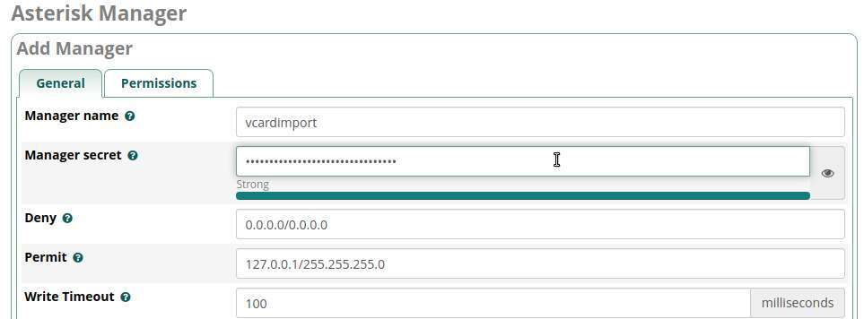
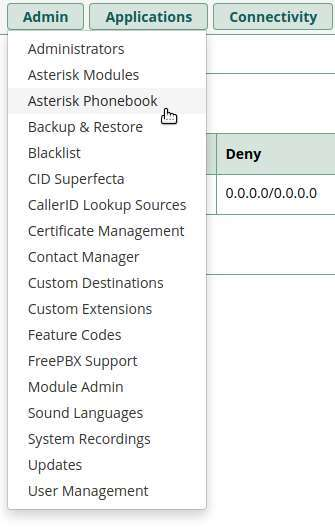

# pyVcf2AsteriskPhonebook

Import Google contacts, or any vCard file, to Asterisk Phonebook.  
Either directly using the Asterisk Management Interface, or export the vCard file to a .csv and import that through FreePBX web UI.  

## FreePBX/RasPBX

### Install prerequisites

Connect via ssh  

    # apt install git python3-pip  

    # apt install emacs #(optional)  

Install python modules  

    # pip3 install lxml panoramisk vobject  

### Asterisk configuration

#### Alternative 1: Use FreePBX web UI (preferred)

Use the FreePBX web UI to add the user vcardimport.  

* Open your FreePBX Adminstration's web UI  
* Click 'Settings'-> 'Asterisk Manager Users'  

* Click 'Add Manager'  
  
* Enter 'Manager name' (user name) and 'Manager secret' (password)  

* Click 'Submit'  

* Click 'Apply config'  

This will make an entry in /etc/asterisk/manager_additional.conf:  

>[vcardimport]  
>secret = YourSecretPassword  
>deny=0.0.0.0/0.0.0.0  
>permit=127.0.0.1/255.255.255.0  
>read = system,call,log,verbose,command,agent,user,config,dtmf,reporting,cdr,dialplan,originate  
>write = system,call,log,verbose,command,agent,user,config,dtmf,reporting,cdr,dialplan,originate  
>writetimeout = 100  

#### Alternative 2: Edit asterisk conf file

Edit manager.conf  

    # emacs /etc/asterisk/manager.conf

Uncomment line to include new file

>include manager_custom.conf

Create new file  

    # emacs /etc/asterisk/manager_custom.conf

>[vcardimport]  
> secret = YourSecretPassword  
> permit = 127.0.0.1/255.255.255.0  
> write = system  

Restart asterisk  

    # rasterisk -x 'manager reload'  

or  

    # asterisk -r

    raspbx*CLI> core restart now  

### Install software

Download sources  

    # git clone https://github.com/jonsag/pyVcf2AsteriskPhonebook  
    # cd pyVcf2AsteriskPhonebook  

Copy config  

    # cp cp config.ini.example config.ini  

Edit config.ini entering your own data and variables.  

    # emacs config.ini  

## Export Google contacts

* Open [Google contacts](http://contacts.google.com)  
* Mark one item  
  
* Click the three dots and click 'Export'  
  
* Mark 'Contacts' and 'vCard' and click 'Export'  
  
* Save your vCards file  

## Usage

### Alternative 1: Update asterisk phonebook directly (preferred)

    # ./pyVcf2AsteriskPhonebook.py -i <path to your .vcf file> -w  

### Alternative 2: Create a .csv file, and manually upload it to FreePBX

    # ./pyVcf2AsteriskPhonebook.py -i <path to your .vcf file> -o <file name>  

This will create a .csv file, with the name you entered, followed by a timestamp and .csv.  

* Open your FreePBX Adminstration's web UI  
* Click 'Admin'->'Asterisk Phonebook'  

* Click 'Import Phonebook'  

* Click 'Browse' and select your .csv the python script created  

* Click 'Upload'  

